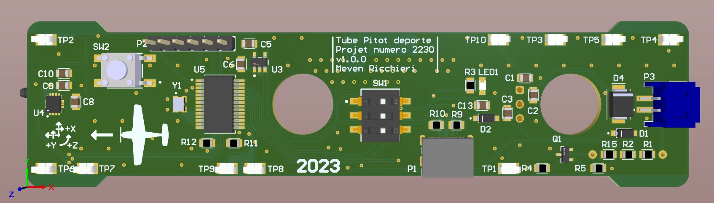
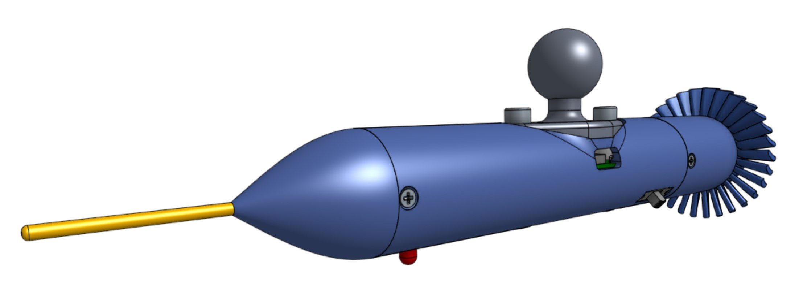
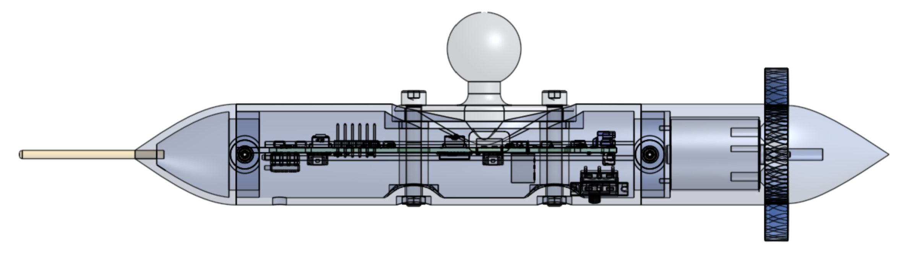
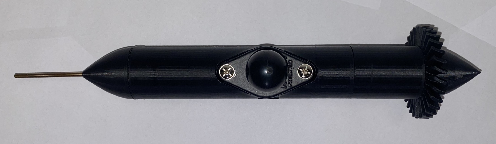
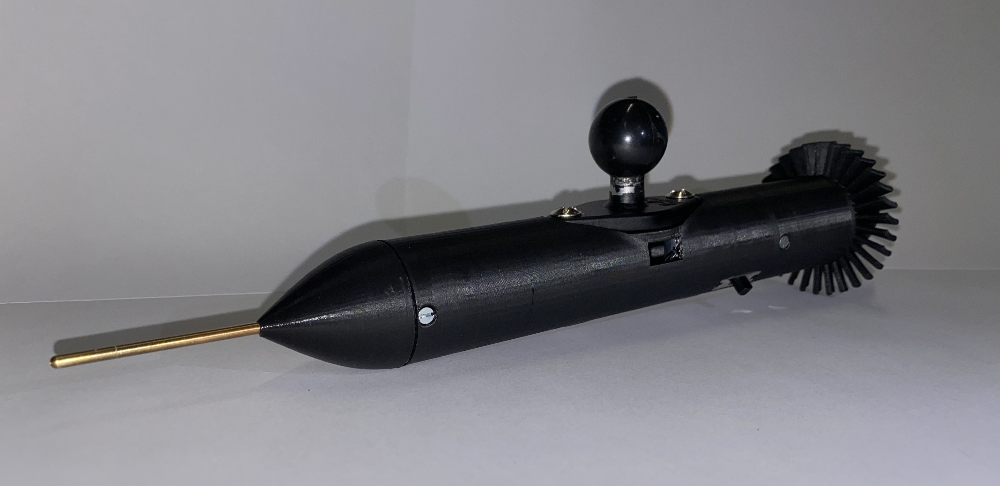
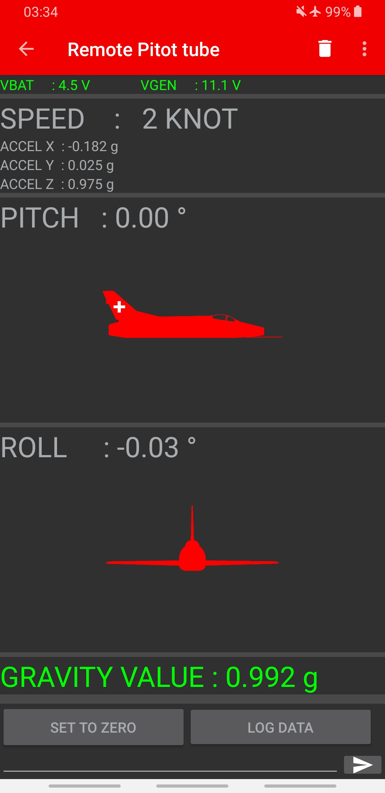

# 2230_TubePitotDeporte

Electronic system designed to measure historical aircraft stall data and transmit them via Bluetooth to an application that displays and records the values.

## [Project report](doc/Versions/2230_TubePitotDeporte_Rapport_Final_v1_0_0.pdf)

## Project poster

## 3D PCB pictures

## 3D Integration

## Application preview

